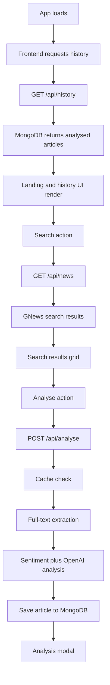
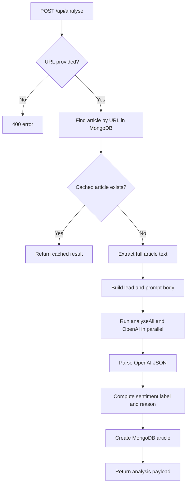
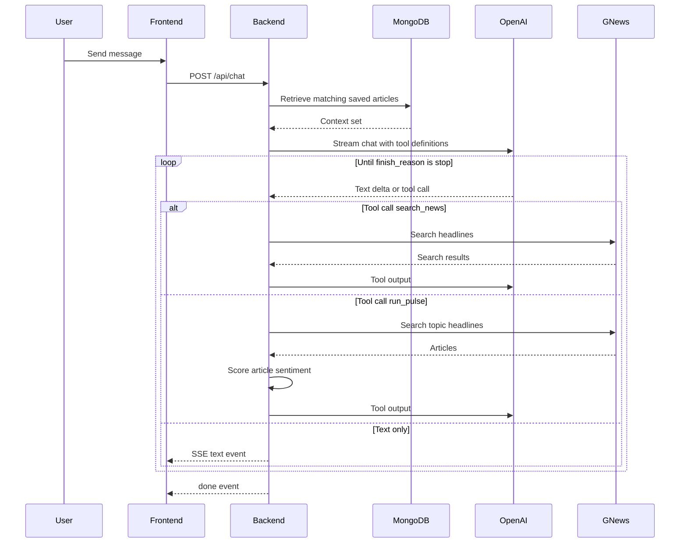
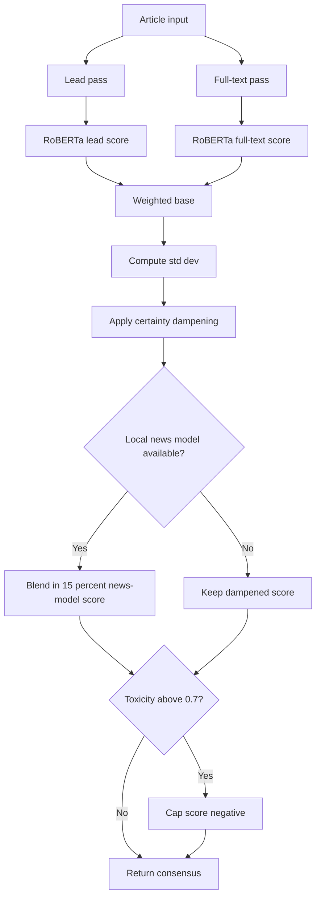

# Aries Smart Reviewer - Internal Documentation

## Architecture overview

```text
Frontend (React/Vite)
  -> env-based API helper
  -> Backend (Express)
     -> MongoDB
     -> GNews
     -> OpenAI
     -> Local sentiment stack
```

The frontend uses `frontend/src/utils/api.js` to decide which backend to call. This avoids the previous split where some screens pointed to localhost and others pointed to Render.

## Visual flows

### Main app loop



### Analyse route



### Chat agent loop



### Sentiment pipeline



## Frontend request flow

### API helper

`frontend/src/utils/api.js`

Resolution order:

1. `VITE_API_URL`
2. `http://localhost:3001` when `VITE_LOCAL_MODELS=true`
3. `https://aries-smart-reviewer.onrender.com`

Exports:

- `API_BASE`
- `apiUrl(path)`
- `apiFetch(path, options)`

### Main consumers

- `App.jsx` for search, history, analyse, and pulse
- `AnalysisPanel.jsx` for related articles
- `ChatPage.jsx` for SSE chat
- `DataCollect.jsx` for bulk analysis

## Backend routes

### `GET /api/news`

File: `backend/routes/news.js`

- Validates `q`
- Calls GNews search
- Maps the response to the article-card shape used by the frontend

### `POST /api/analyse`

File: `backend/routes/analyse.js`

- Requires `url`
- Checks MongoDB cache first
- Attempts article extraction
- Builds a prompt body for OpenAI
- Runs `analyseAll()` and OpenAI in parallel
- Saves the result to MongoDB

Potential failure points:

- Mongo connection
- article extraction timeouts
- local sentiment model load/inference
- OpenAI response parsing

### `GET /api/pulse`

File: `backend/routes/pulse.js`

- Requires `q`
- Calls GNews search
- Runs `analyseAll()` sequentially for each result
- Sorts by score descending

Potential failure points:

- GNews timeout
- local model timeout or crash

### `GET /api/related`

File: `backend/routes/related.js`

- Requires `q`
- Searches GNews
- Excludes the current article URL
- Returns up to 5 results

### `POST /api/chat`

File: `backend/routes/chat.js`

- Requires `messages`
- Streams SSE events
- Retrieves article context from MongoDB
- Supports OpenAI tool calling
- Uses `search_news` and `run_pulse`

Event types:

- `text`
- `tool_start`
- `tool_end`
- `done`
- `error`

## Sentiment internals

File: `backend/sentiment.js`

### Models

- Xenova Twitter RoBERTa sentiment pipeline
- TensorFlow toxicity model
- optional local TensorFlow news model from disk

### Consensus logic

1. Score lead text.
2. Score full text.
3. Blend lead and full text with weights.
4. Reduce certainty when the two passes disagree.
5. Add the local news model if available.
6. Cap into negative territory when toxicity is very high.

### Startup behavior

`backend/index.js` preloads the sentiment model after MongoDB connects:

```js
loadSentimentModel().catch(err => console.warn('[sentiment] Preload failed:', err.message))
```

That means startup can succeed even if model preload fails, but later requests may still error if a route depends on `analyseAll()` and the model was never loaded correctly.

## Troubleshooting

### CORS errors on localhost

Usually not true CORS configuration bugs. Common causes:

- frontend is calling the hosted backend instead of local
- hosted backend is unhealthy and returning a non-Express error page

Check `frontend/src/utils/api.js` and your frontend env vars first.

### Intermittent 500 errors

Most likely causes in this codebase:

- MongoDB Atlas connectivity
- GNews API timeouts
- OpenAI failures
- RoBERTa model download/load failures

If `LOCAL_MODELS=true`, Pulse and Analyse are more fragile because they depend on local sentiment inference.

### Mongo timeout at startup

If the backend exits with:

```text
MongoDB connection error: Server selection timed out after 30000 ms
```

check:

- Atlas network access / IP allowlist
- database username and password
- `MONGODB_URI`
- general outbound network connectivity

## Data model

```js
Article {
  title: String,
  description: String,
  url: String,
  source: String,
  publishedAt: String,
  image: String,
  summary: String,
  sentiment: "positive" | "neutral" | "negative",
  sentimentScore: Number,
  sentimentReason: String,
  topics: [String],
  biasSummary: String,
  biasIndicators: [String],
  reviewerScores: [{ name, score, note }],
  analysedAt: Date
}
```
