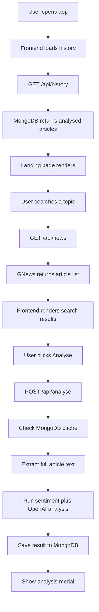
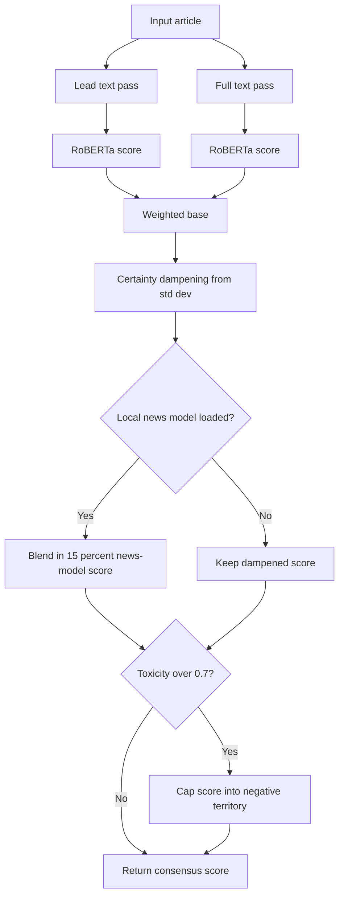
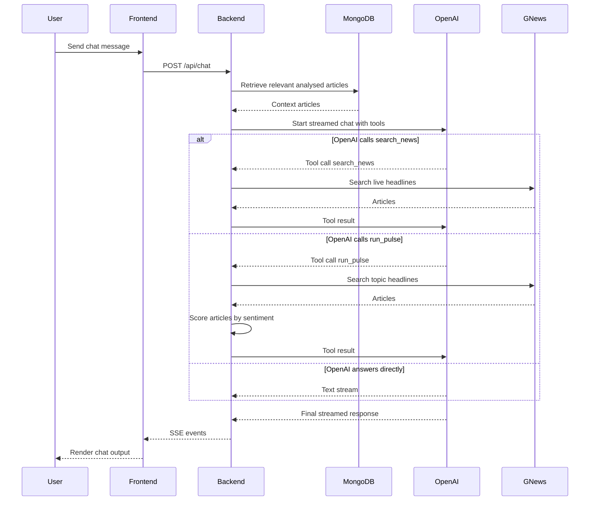

# Smart Reviewer

Smart Reviewer is a full-stack news analysis app. It lets you search live headlines, analyse individual articles, compare sentiment across a topic, and chat with a news-aware assistant that can use your saved history as context and run tools.

## Core features

- Search live articles through GNews.
- Analyse a single article for summary, topics, sentiment, and framing.
- Save analysed articles to MongoDB and reopen them from history.
- Run Topic Pulse to rank current coverage by sentiment.
- Use a chat sidebar backed by OpenAI tool calling plus lightweight retrieval from your saved analyses.

## Stack

| Layer | Tech |
|---|---|
| Frontend | React + Vite |
| Backend | Node.js + Express |
| Database | MongoDB + Mongoose |
| News source | GNews API |
| AI analysis | OpenAI `gpt-4o-mini` |
| Local sentiment | Xenova RoBERTa + TensorFlow.js |
| Streaming | Server-Sent Events |

## Project structure

```text
aries-smart-reviewer/
├── backend/
│   ├── index.js
│   ├── sentiment.js
│   ├── train.js
│   ├── models/
│   │   └── Article.js
│   └── routes/
│       ├── news.js
│       ├── analyse.js
│       ├── pulse.js
│       ├── related.js
│       └── chat.js
└── frontend/
    └── src/
        ├── App.jsx
        ├── components/
        └── utils/
            ├── api.js
            └── sentiment.js
```

## Environment

### `backend/.env`

```bash
MONGODB_URI=mongodb+srv://<user>:<password>@<cluster>.mongodb.net/<dbname>
OPENAI_API_KEY=sk-...
GNEWS_API_KEY=...
PORT=3001
LOCAL_MODELS=true
```

### `frontend/.env`

```bash
VITE_LOCAL_MODELS=true
```

Optional:

```bash
VITE_API_URL=http://localhost:3001
```

Frontend API resolution is:

1. Use `VITE_API_URL` if it is set.
2. Otherwise use `http://localhost:3001` when `VITE_LOCAL_MODELS=true`.
3. Otherwise use `https://aries-smart-reviewer.onrender.com`.

## Running locally

Backend:

```bash
cd backend
npm install
npm run dev
```

Frontend:

```bash
cd frontend
npm install
npm run dev
```

When developing locally, make sure the frontend resolves to the local backend. The current frontend helper in `frontend/src/utils/api.js` handles that via env vars.

## Flowcharts

### Main app flow



### Sentiment pipeline



### Chat loop



## How the app works

### Search

`GET /api/news?q=<query>`

- Proxies the query to GNews.
- Returns up to 10 articles with title, description, URL, source, date, and image.

### Article analysis

`POST /api/analyse`

Flow:

1. Check MongoDB for an existing article with the same URL.
2. Attempt full-text extraction with `@extractus/article-extractor`.
3. Build a lead excerpt from the article body or description.
4. Run local sentiment analysis and OpenAI analysis in parallel.
5. Store the merged result in MongoDB.

Returned fields include:

- `summary`
- `topics`
- `biasSummary`
- `biasIndicators`
- `sentiment`
- `sentimentScore`
- `sentimentReason`
- `reviewerScores`

### Sentiment pipeline

Implemented in `backend/sentiment.js`.

The local pipeline uses:

1. A RoBERTa lead-paragraph pass.
2. A RoBERTa full-text pass.
3. An optional local TensorFlow news model from `backend/news-sentiment-model/`.
4. An optional toxicity model.

Lead and full-text scores are blended with weights of 0.35 and 0.65. Disagreement lowers certainty. If the local news model exists, it nudges the final score. High toxicity can cap the final score into negative territory.

Important:

- `backend/index.js` preloads the local sentiment model at startup.
- If model download or loading fails, routes that depend on local sentiment can return `500`.
- `LOCAL_MODELS=true` enables the heavier local pipeline.

### Topic Pulse

`GET /api/pulse?q=<topic>`

- Fetches up to 10 current articles from GNews.
- Scores each article sequentially through `analyseAll()` to avoid large concurrent memory spikes.
- Sorts results from most positive to most negative.
- Does not save results to MongoDB.

### Related articles

`GET /api/related?q=<topic>&exclude=<url>`

- Searches GNews for related coverage.
- Filters out the currently viewed article.
- Returns up to 5 alternative links.

### Chat

`POST /api/chat`

The chat route:

1. Pulls relevant analysed articles from MongoDB using keyword matching.
2. Injects those articles into the system prompt as lightweight retrieval context.
3. Streams responses from OpenAI over SSE.
4. Lets the model call two tools:
   - `search_news`
   - `run_pulse`

## API reference

| Method | Endpoint | Description |
|---|---|---|
| `GET` | `/api/news?q=query` | Search GNews |
| `POST` | `/api/analyse` | Analyse and cache an article |
| `GET` | `/api/history` | Return analysed articles, newest first |
| `GET` | `/api/pulse?q=topic` | Rank current coverage by sentiment |
| `GET` | `/api/related?q=topic&exclude=url` | Fetch related coverage |
| `GET` | `/api/model/status` | Report loaded-model status and article count |
| `POST` | `/api/chat` | Stream chat responses over SSE |

## Known failure points

These are the main reasons you may see intermittent `500` responses during development:

- MongoDB Atlas connection failures.
- GNews timeouts or invalid API responses.
- OpenAI API failures or malformed JSON output.
- Local sentiment model download/load issues when `LOCAL_MODELS=true`.

If you are developing on localhost and see CORS-like errors, first confirm the frontend is pointing at the local backend instead of the hosted Render URL.

## Security note

Keep API keys and database credentials only in `.env` files. If a real key has ever been exposed in logs, screenshots, or committed history, rotate it.
